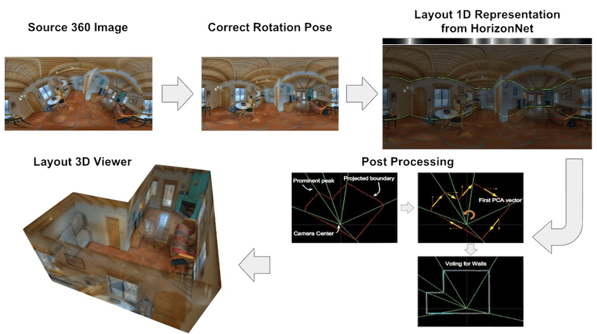
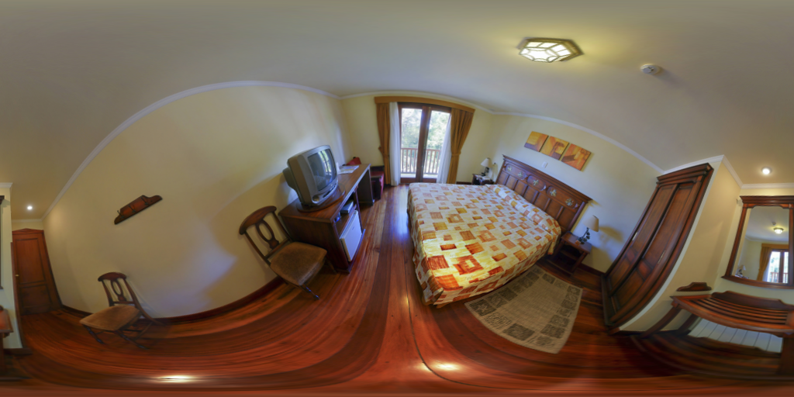
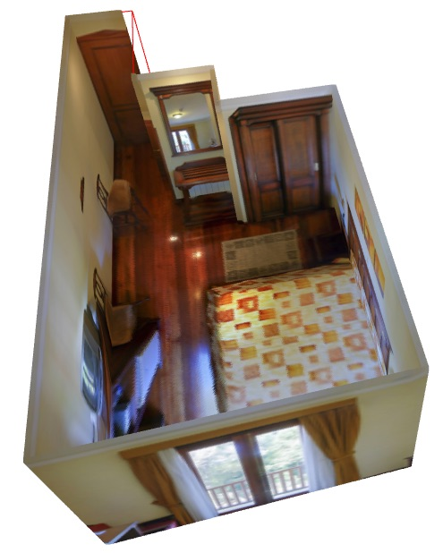

# HorizonNet

[](https://paperswithcode.com/sota/3d-room-layouts-from-a-single-rgb-panorama?p=horizonnet-learning-room-layout-with-1d)
[](https://paperswithcode.com/sota/3d-room-layouts-from-a-single-rgb-panorama-1?p=horizonnet-learning-room-layout-with-1d)

This is the implementation of our CVPR'19 "[
HorizonNet: Learning Room Layout with 1D Representation and Pano Stretch Data Augmentation](https://arxiv.org/abs/1901.03861)" ([project page](https://sunset1995.github.io/HorizonNet/)).

**News, June 15** - Critical bug fix for general layout (`dataset.py`, `inference.py` and `misc/post_proc.py`)  
**News, Aug 19** - Report results on [Structured3D dataset](https://structured3d-dataset.org/) ([see the report](README_ST3D.md)).


This repo is a **pure python** implementation that you can:
- **Inference on your images** to get cuboid or general shaped room layout
- **3D layout viewer**
- **Correct pose** for your panorama images
- **Pano Stretch Augmentation** copy and paste to apply on your own task
- **Quantitative evaluatation** (3D IoU, Corner Error, Pixel Error)
    - cuboid shape
    - general shape
- **Your own dataset** preparation and training

**Method Pipeline overview**:


## Requirements
- Python 3
- pytorch>=1.0.0
- numpy
- scipy
- sklearn
- Pillow
- tqdm
- tensorboardX
- opencv-python>=3.1 (for pre-processing)
- open3d>=0.7 (for layout 3D viewer)


## Download
- [PanoContext/Stanford2D3D Dataset](https://drive.google.com/open?id=1e-MuWRx3T4LJ8Bu4Dc0tKcSHF9Lk_66C) for training/validation/testing
    - Put all of them under `data` directory so you should get:
        ```
        HorizonNet/
        |--data/
        |  |--finetune_general/
        |  |--test/
        |  |--train/
        |  |--valid/
        ```
    - `test`, `train`, `valid` are processed from [LayoutNet's cuboid dataset](https://github.com/zouchuhang/LayoutNet).
    - `finetune_general` is re-annotated by us from `train` and `valid`. It contains  65 general shaped rooms.
- [Cuboid room pretrained model](https://drive.google.com/open?id=1N3y2AVrd8GATVdz7VPjS8r24bDSmpbb7)
    - Trained on `train/` 817 pano images
- [General room pretrained model](https://drive.google.com/open?id=1y7I4jfruer4uoMs0_YHAHHUDlcpGZmc-)
    - Trained on `train/` 817 pano images first
    - Finetuned on `finetune_general/` 66 images
- [General room pretrained on Structured3D dataset](https://drive.google.com/open?id=1e4tXagwEYAhEmyzsiZiMxAKW481NETFJ)
    - More detail see [here](README_ST3D.md)


## Inference on your images

In below explaination, I will use `assets/demo.png` for example.
-  (modified from PanoContext dataset)


### 1. Pre-processing (Align camera rotation pose)
- **Execution**: Pre-process the above `assets/demo.png` by firing below command.
    ```
    python preprocess.py --img_glob assets/demo.png --output_dir assets/preprocessed/
    ```
    - `--img_glob` telling the path to your 360 room image(s).
        - support shell-style wildcards with quote (e.g. `"my_fasinated_img_dir/*png"`).
    - `--output_dir` telling the path to the directory for dumping the results.
    - See `python preprocess.py -h` for more detailed script usage help.
- **Outputs**: Under the given `--output_dir`, you will get results like below and prefix with source image basename.
    - The aligned rgb images `[SOURCE BASENAME]_aligned_rgb.png` and line segments images `[SOURCE BASENAME]_aligned_line.png`
        - `demo_aligned_rgb.png` | `demo_aligned_line.png`
          :--------------------: | :---------------------:
           | 
    - The detected vanishing points `[SOURCE BASENAME]_VP.txt` (Here `demo_VP.txt`)
        ```
        -0.002278 -0.500449 0.865763
        0.000895 0.865764 0.500452
        0.999999 -0.001137 0.000178
        ```


### 2. Estimating layout with HorizonNet
- **Execution**: Predict the layout from above aligned image and line segments by firing below command.
    ```
    python inference.py --flip --pth ckpt/finetune_general.pth --img_glob assets/preprocessed/demo_aligned_rgb.png --output_dir assets/inferenced --visualize --relax_cuboid
    ```
    - `--flip` optional testing augmentation.
    - `--pth` path to the trained model.
    - `--img_glob` path to the preprocessed image.
    - `--output_dir` path to the directory to dump results.
    - `--visualize` optinoal for visualizing model raw outputs.
    - `--relax_cuboid`
        - **Model trained on cuboid only**: do NOT add `--relax_cuboid` to force outputing cuboid
        - **Model trained on general shaped**: always add `--relax_cuboid`
- **Outputs**: You will get results like below and prefix with source image basename.
    - The 1d representation are visualized under file name `[SOURCE BASENAME].raw.png`
    - The extracted corners of the layout `[SOURCE BASENAME].json`
        ```
        {"z0": 50.0, "z1": -53.993988037109375, "uv": [[0.0146484375, 0.3008330762386322], [0.0146484375, 0.7089354991912842], [0.007335239555686712, 0.38581281900405884], [0.007335239555686712, 0.6204522848129272], [0.0517578125, 0.3912762403488159], [0.0517578125, 0.6146637797355652], [0.4485706090927124, 0.3936861753463745], [0.4485706090927124, 0.6121071577072144], [0.5978592038154602, 0.4077087640762329], [0.5978592038154602, 0.597193717956543], [0.8074917793273926, 0.35766440629959106], [0.8074917793273926, 0.6501006484031677], [0.8803366422653198, 0.2525349259376526], [0.8803366422653198, 0.7577382922172546], [0.925480306148529, 0.3167843818664551], [0.925480306148529, 0.6925708055496216]]}
        ```


### 3. Layout 3D Viewer
- **Execution**: Visualizing the predicted layout in 3D using points cloud.
    ```
    python layout_viewer.py --img assets/preprocessed/demo_aligned_rgb.png --layout assets/inferenced/demo_aligned_rgb.json --ignore_ceiling
    ```
    - `--img` path to preprocessed image
    - `--layout` path to the json output from `inference.py`
    - `--ignore_ceiling` prevent showing ceiling
    - See `python layout_viewer.py -h` for usage help.
- **Outputs**: In the window, you can use mouse and scroll wheel to change the viewport
    - 


## Your own dataset
See [tutorial](README_PREPARE_DATASET.md) on how to prepare it.  


## Training
To train on a dataset, see `python train.py -h` for detailed options explaination.  
Example:
```
python train.py --id resnet50_rnn
```
- Important arguments:
    - `--id` required. experiment id to name checkpoints and logs
    - `--ckpt` folder to output checkpoints (default: ./ckpt)
    - `--logs` folder to logging (default: ./logs)
    - `--pth` finetune mode if given. path to load saved checkpoint.
    - `--backbone` {resnet18,resnet50,resnet101} backbone of the network (default: resnet50)
    - `--no_rnn` whether to remove rnn (default: False)
    - `--train_root_dir` root directory to training dataset. (default: `data/train`)
    - `--valid_root_dir` root directory to validation dataset. (default: `data/valid/`)
    - `--batch_size_train` training mini-batch size (default: 8)
    - `--epochs` epochs to train (default: 300)
    - `--lr` learning rate (default: 0.0001)


## Quantitative Evaluation - Cuboid Layout
To evaluate on LayoutNet dataset, first running the cuboid trained model for all testing images:
```
python inference.py --flip --pth ckpt/resnet50-rnn.pth --img_glob "data/test/img/*png" --output_dir tmp
```
- `--flip` optional testing augmentation.
- `--img_glob` shell-style wildcards for all testing images.
- `--output_dir` path to the directory to dump results.

To get the quantitative result:
```
python eval_cuboid.py --dt_glob "tmp/*json" --gt_glob "data/test/label_cor/*txt"
```
- `--dt_glob` shell-style wildcards for all the model estimation.
- `--gt_glob` shell-style wildcards for all the ground truth.
Replace `"tmp/*json"`
- with `"tmp/pano*json"` for evaluate on PaonContext only
- with `"tmp/camera*json"` for evaluate on Stanford2D3D only

The quantitative result for the pretrained model is shown below:

| Testing Dataset | 3D IoU(%) | Corner error(%) | Pixel error(%) |
| :-------------: | :-------: | :------: | :--------------: |
| PanoContext     | `82.96` | `0.75` | `2.16` |
| Stanford2D3D    | `83.80` | `0.65` | `1.96` |
| All             | `83.53` | `0.68` | `2.02` |


## Quantitative Evaluation - Genral Layout
**Note:** run `inference.py` with `--relax_cuboid` for general layout.

See `eval_general.py`, arguments are the same as `eval_cuboid.py`.


## TODO
- Faster pre-processing script (top-fron alignment) (maybe cython implementation or [fernandez2018layouts](https://github.com/cfernandezlab/Lines-and-Vanishing-Points-directly-on-Panoramas))


## Acknowledgement
- Credit of this repo is shared with [ChiWeiHsiao](https://github.com/ChiWeiHsiao).
- Thanks [limchaos](https://github.com/limchaos) for the suggestion about the potential boost by fixing the non-expected behaviour of Pytorch dataloader. (See [Issue#4](https://github.com/sunset1995/HorizonNet/issues/4))


## Citation
Please cite our paper for any purpose of usage.
```
@InProceedings{Sun_2019_CVPR,
    author = {Sun, Cheng and Hsiao, Chi-Wei and Sun, Min and Chen, Hwann-Tzong},
    title = {HorizonNet: Learning Room Layout With 1D Representation and Pano Stretch Data Augmentation},
    booktitle = {The IEEE Conference on Computer Vision and Pattern Recognition (CVPR)},
    month = {June},
    year = {2019}
}
```

