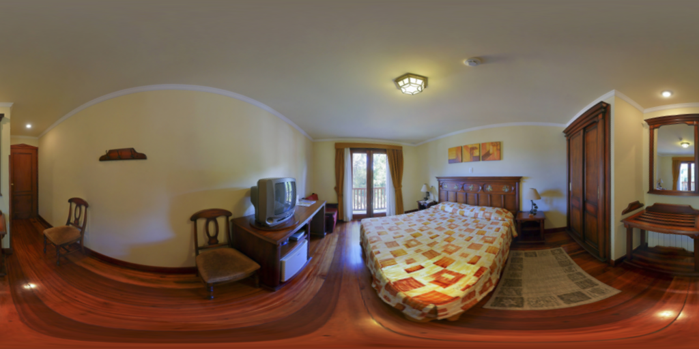
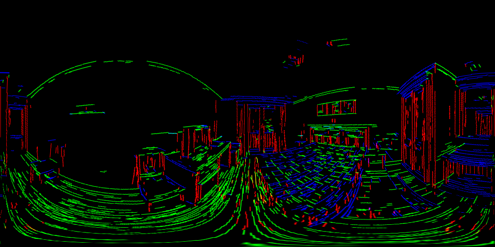

# HorizonNet

**[This project is under construction. Will be updated recently.]**

This is the implementation of our CVPR'19 [
HorizonNet: Learning Room Layout with 1D Representation and Pano Stretch Data Augmentation](https://arxiv.org/abs/1901.03861)

Overview of the pipeline:


Use this repo, you can:
- [WIP] Extract layout of your own 360 images with our trained **HorizonNet**
- Layout 3D viewer
- [WIP] Train on your own dataset (not limit to cuboid)
- Copy the proposed **Pano Stretch Augmentation** to use on your own task
- Quantitative evaluatation (3D IoU, Corner Error, Pixel Error)


## Requirements
- Python 3
- pytorch>=1.0.0
- numpy
- scipy
- sklearn
- Pillow
- tqdm
- tensorboardX
- opencv-python>=3.1 (for pre-processing)
- open3d (for layout 3D viewer)
- shapely (for layout 3D viewer)


## How to Run

### 1. Preparation
- Get your fasinated 360 room images. I will use `assets/demo.png` for example.
    -  (modified from PanoContext dataset)
- Prepare the enviroment to run the python scripts.
- Download the trained model from *[TO BE RELEASED]*


### 2. Pre-processing (Align camera rotation pose)
- Pre-process the above `assets/demo.png` by firing below command. See `python preprocess.py -h` for more detailed script usage help.
    ```
    python preprocess.py --img_glob assets/demo.png --output_dir assets/preprocessed/
    ```
    - Arguments explanation:
        - `--img_glob` telling the path to your fasinated 360 room image(s).
        - `--output_dir` telling the path to the directory for dumping the results.
        - *Hint*: you can use shell-style wildcards with quote (e.g. "my_fasinated_img_dir/\*png") to process multiple images in one shot.
- Under the given `--output_dir`, you will get results like below and prefix with source image basename.
    - The aligned rgb images `[SOURCE BASENAME]_aligned_rgb.png` and line segments images `[SOURCE BASENAME]_aligned_line.png`
        - `demo_aligned_rgb.png` | `demo_aligned_line.png`
          :--------------------: | :---------------------:
           | 
    - The detected vanishing points `[SOURCE BASENAME]_VP.txt` (Here `demo_VP.txt`)
        ```
        -0.006676 -0.499807 0.866111
        0.000622 0.866128 0.499821
        0.999992 -0.002519 0.003119
        ```
- *[TODO]* implement other VPs detection algorithm to reduce processing time


### 3. Estimating layout with HorizonNet
- Predict the layout from above aligned image and line segments by firing below command.
    ```
    python inference.py --pth ckpt/resnet50-rnn.pth --img_glob assets/preprocessed/demo_aligned_rgb.png --output_dir assets/inferenced --visualize
    ```
- Arguments explanation:
    - `--pth` path to the trained model.
    - `--img_glob` path to the preprocessed image.
    - `--output_dir` path to the directory to dump results.
    - *Hint*: for the two glob, you can use wildcards with quote
    - *Hint*: for better result, you can add `--flip`, `--rotate 0.25 0.5 0.75`, `--post_optimization`
- you will get results like below and prefix with source image basename.
    - The 1d representation are visualized under file name `[SOURCE BASENAME].raw.png`
    - The extracted corners of the layout `[SOURCE BASENAME].json`
        ```
        {"z0": 50.0, "z1": -55.15687561035156, "uv": [[0.10213533043861389, 0.31251659989356995], [0.10213533043861389, 0.7001833319664001], [0.4487144351005554, 0.39285698533058167], [0.4487144351005554, 0.6152310967445374], [0.5983865857124329, 0.4072076976299286], [0.5983865857124329, 0.5997158288955688], [0.8371391892433167, 0.3685642182826996], [0.8371391892433167, 0.6412822008132935]]}
        ```


### 4. Layout 3D Viewer
- A pure python script to visualize the predicted layout in 3D using points cloud. See `python layout_viewer.py -h` for usage help.
    ```
    python layout_viewer.py --img assets/preprocessed/demo_aligned_rgb.png --layout assets/inferenced/demo_aligned_rgb.json --ignore_ceiling
    ```
    - Arguements explanation:
        - `--img` path to preprocessed image
        - `--layout` path to the json output from `inference.py`
        - `--ignore_ceiling` prevent showing ceiling
- 
    - In the window, you can use mouse and scroll to change the viewport


## How to Train
[WIP]


## Quantitative Evaluation
[WIP]


## Citation
Please cite our paper for any purpose of usage.
```
@article{sun2019horizonnet,
  title={HorizonNet: Learning Room Layout with 1D Representation and Pano Stretch Data Augmentation},
  author={Sun, Cheng and Hsiao, Chi-Wei and Sun, Min and Chen, Hwann-Tzong},
  journal={arXiv preprint arXiv:1901.03861},
  year={2019}
}
```

