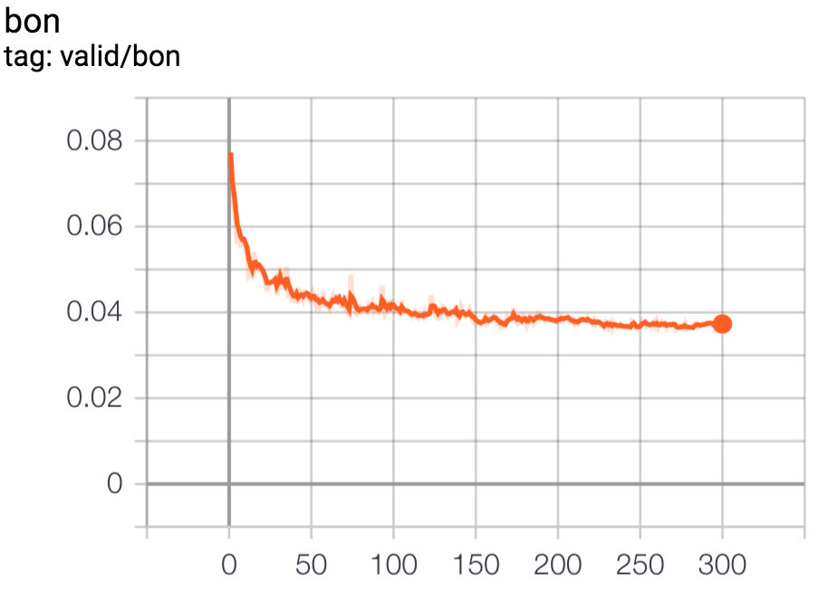
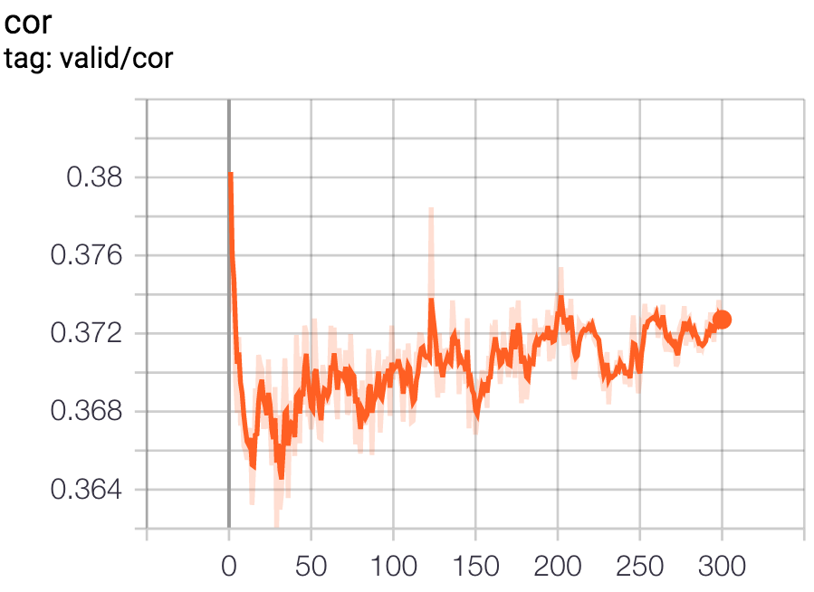
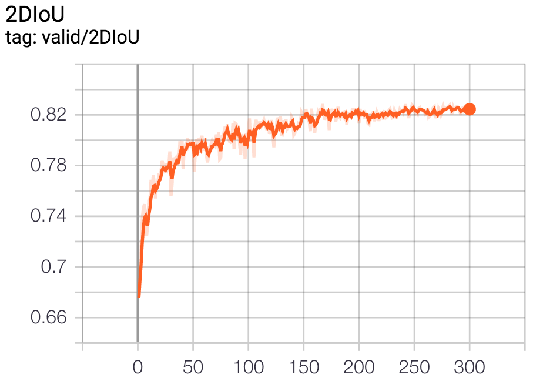
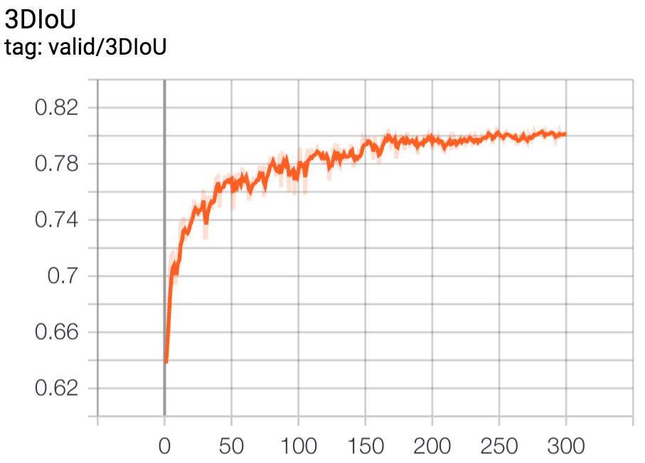

# Results on MatterportLayout dataset

References:
- [3D Manhattan Room Layout Reconstruction from a Single 360 Image](https://arxiv.org/abs/1910.04099)
- [Matterport3DLayoutAnnotation github](https://github.com/ericsujw/Matterport3DLayoutAnnotation)
- [LayoutNetv2 github](https://github.com/zouchuhang/LayoutNetv2)
- [DuLa-Net github](https://github.com/SunDaDenny/DuLa-Net)

## Dataset preparation
- Please refer to [Matterport3DLayoutAnnotation](https://github.com/ericsujw/Matterport3DLayoutAnnotation) to prepare the source datas.
    - Put all the rgb under `{ROOT}/image_up/`.
    - Download the annotation to `{ROOT}/label_data/` (originally json format).
    - Download the data split into `{ROOT}/mp3d_[train|val|test].txt`.
- Use below code to convert original ground-truth json into txt. (Remember to update the uppercase variables)
    ```python
    import os
    import glob
    import json
    import numpy as np

    IN_GLOB = 'label_data/*json'
    OUT_DIR = 'label_cor'
    os.makedirs(OUT_DIR, exist_ok=True)

    for p in glob.glob(IN_GLOB):
        gt = json.load(open(p))
        assert gt['cameraHeight'] == 1.6
        us = np.array([pts['coords'][0] for pts in gt['layoutPoints']['points']])
        us = us * 1024
        cs = np.array([pts['xyz'] for pts in gt['layoutPoints']['points']])
        cs = np.sqrt((cs**2)[:, [0, 2]].sum(1))

        vf = np.arctan2(-1.6, cs)
        vc = np.arctan2(-1.6 + gt['layoutHeight'], cs)
        vf = (-vf / np.pi + 0.5) * 512
        vc = (-vc / np.pi + 0.5) * 512

        cor_x = np.repeat(us, 2)
        cor_y = np.stack([vc, vf], -1).reshape(-1)
        cor_xy = np.stack([cor_x, cor_y], -1)

        out_path = os.path.join(OUT_DIR, os.path.split(p)[-1][:-4] + 'txt')
        with open(out_path, 'w') as f:
            for x, y in cor_xy:
                f.write('%.2f %.2f\n' % (x, y))
    ```
- Use below code to organize the data for training and evaluation. (Remember to update the uppercase variables)
    ```python
    import os
    from shutil import copy2

    IMG_ROOT = 'image_up'
    TXT_ROOT = 'label_cor'
    OUT_ROOT = 'mp3d_layout'
    TRAIN_TXT = 'mp3d_train.txt'
    VALID_TXT = 'mp3d_val.txt'
    TEST_TXT = 'mp3d_test.txt'

    def go(txt, split):
        out_img_root = os.path.join(OUT_ROOT, split, 'img')
        out_txt_root = os.path.join(OUT_ROOT, split, 'label_cor')
        os.makedirs(out_img_root, exist_ok=True)
        os.makedirs(out_txt_root, exist_ok=True)

        with open(txt) as f:
            ks = ['_'.join(l.strip().split()) for l in f]

        for k in ks:
            copy2(os.path.join(IMG_ROOT, k + '.png'), out_img_root)
            copy2(os.path.join(TXT_ROOT, k + '_label.txt'), out_txt_root)
            os.rename(os.path.join(out_txt_root, k + '_label.txt'), os.path.join(out_txt_root, k + '.txt'))


    go(TRAIN_TXT, 'train')
    go(VALID_TXT, 'valid')
    go(TEST_TXT, 'test')
    ```
- So now, you should have a `mp3d_layout` directory with below structure for HorizonNet to train.
    ```
    mp3d_layout/
    |--train/
    |  |--img/
    |  |  |--*.png
    |  |--label_cor/
    |  |  |--*.txt
    |--valid/
    |  |--img/
    |  |  |--*.png
    |  |--label_cor/
    |  |  |--*.txt
    |--test/
    |  |--img/
    |  |  |--*.png
    |  |--label_cor/
    |  |  |--*.txt
    ```

## Training
```bash
python train.py --train_root_dir data/mp3d_layout/train/ --valid_root_dir data/mp3d_layout/valid/ --id resnet50_rnn__mp3d --batch_size_train 4 --epochs 300 --lr 1e-4
```
See `python train.py -h` or [README.md#training](https://github.com/sunset1995/HorizonNet#training) for more detail.

Download the trained model: [resnet50_rnn__mp3d.pth](https://drive.google.com/open?id=1uEEhPVw6VbjwW3lO4btb8zExV8NqojTB).
- Trained on MatterportLayout 1650 pano images.
- Trained for 300 epoch.
- Select 242nd epoch according to 3DIoU on validation set.

The loss and IoU plots on validation set during the training coarse:

| `bon loss` | `cor loss` | `2D IoU` | `3D IoU` |
| :------: | :------: | :----: | :----: |
|  |  |  |  |

Some observation and random thought about the training detail:
- The `cor loss` look strange. It seems that the lowest `cor loss` appears at very first epoch. Could it be due to the imbalance or any difficulty in the multi task training (`bon loss` vs. `cor loss`)?
- The `bon loss`, `2D IoU`, `3D IoU` keep going down during the progress. Maybe training more epochs can get even better result?
- Take a closer look into the plot of `3D IoU`. The model can struggle for dozens of epochs but improve finally.
    - `77.73%` on ep58, the next time better is `77.85%` on ep71
    - `79.15%` on ep101, the next time better is `79.23%` on ep127
    - The best appear on ep242 with `80.49%`
- Maybe training for a very long epochs (say 1k epochs) and select the best on validation set along the way could be a better scheme.

## Testing
Generating layout for testing set:
```bash
python inference.py --pth ckpt/resnet50_rnn__mp3d.pth --img_glob "data/mp3d_layout/test/img/*" --output_dir output/mp3d/resnet50_rnn --visualize
```
- `--output_dir`: a directory you want to dump the extracted layout
- `--visualize`: visualize raw output (without post-processing) from HorizonNet.


## Quantitative evaluatation:
```bash
python eval_general.py --dt_glob "output/mp3d/resnet50_rnn/*json" --gt_glob "data/mp3d_layout/test/label_cor/*"
```

:clipboard: Below is the quantitative result on MatterportLayout testing set.

| # of corners | instances |  3D IoU  | 2D IoU  | RMSE   | delta^1 |
| :----------: | :-------: | :------: | :-----: | :----: | :----: |
| 4            | 262       | `81.49`  | `84.22` | `0.18` | `0.95` |
| 6            | 84        | `82.65`  | `84.88` | `0.19` | `0.96` |
| 8            | 63        | `73.30`  | `75.19` | `0.29` | `0.94` |
| 10+          | 49        | `68.50`  | `70.46` | `0.43` | `0.89` |
| overall      | 458       | `79.19`  | `81.63` | `0.22` | `0.94` |

- The `3D IoU` and `2D IoU` similar to official reported.
- :exclamation: The `RMSE` and `delta^1` implementation is different from official.
- It could be due to the different implementation of layout to depth (I hope not due to my bug).
- I use below code to evaluate LayoutNetv2 (official released) with depth metric of my implementation. The results are:
    - RMSE of my implementation
        - LayoutNetv2: `0.28`
        - `resnet50_rnn__mp3d.pth`: `0.22`
    - delta^1 of my implementation
        - LayoutNetv2: `0.90`
        - `resnet50_rnn__mp3d.pth`: `0.94`

```python
import os
import cv2
import glob
import numpy as np
from tqdm import tqdm
from scipy.io import loadmat
from eval_general import layout_2_depth

OFFICIAL_ROOT = '/home/sunset/Datasets/MatterportLayout/result_gen_depth/'
GT_ROOT = '/home/sunset/Datasets/MatterportLayout/mp3d_layout/test/label_cor/'

rmse_lst = []
delta_1_lst = []
for dt_path in tqdm(glob.glob(os.path.join(OFFICIAL_ROOT, '*mat'))):
    dt_depth = loadmat(dt_path)['im_depth']
    dt_depth = cv2.resize(dt_depth, (1024, 512))
    k = os.path.split(dt_path)[-1][:-4]
    gt_path = os.path.join(GT_ROOT, k + '.txt')
    with open(gt_path) as f:
        gt_cor_id = np.array([l.split() for l in f], np.float32)
    gt_depth = layout_2_depth(gt_cor_id, 512, 1024)
    gt_depth = gt_depth
    dt_depth = dt_depth
    rmse = ((gt_depth - dt_depth)**2).mean() ** 0.5
    thres = np.maximum(gt_depth/dt_depth, dt_depth/gt_depth)
    delta_1 = (thres < 1.25).mean()
    rmse_lst.append(rmse)
    delta_1_lst.append(delta_1)

print('rmse', np.mean(rmse_lst))
print('delta_1', np.mean(delta_1_lst))
```
